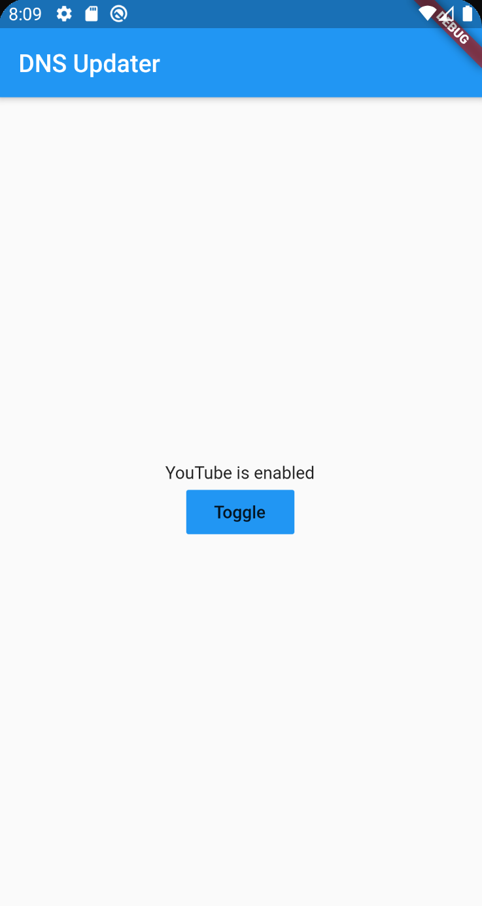

# cradlepoint_http

 Cradlepoint DNS Updater
    
    A simple Flutter app to update the DNS mode on Cradlepoint routers.
    I use this to switch from the auto DNS assigned by the ISP and
    OpenDNS to enable/disable youtube and games when the kids are
    supposed to be working with their online school.
    
    TODO:
    - Find the router IP dynamically
    - Allow the user to input and save the password instead of having it baked into code

## Getting Started

This project is a starting point for a Flutter application.

A few resources to get you started if this is your first Flutter project:

- [Lab: Write your first Flutter app](https://flutter.dev/docs/get-started/codelab)
- [Cookbook: Useful Flutter samples](https://flutter.dev/docs/cookbook)

For help getting started with Flutter, view our
[online documentation](https://flutter.dev/docs), which offers tutorials,
samples, guidance on mobile development, and a full API reference.
