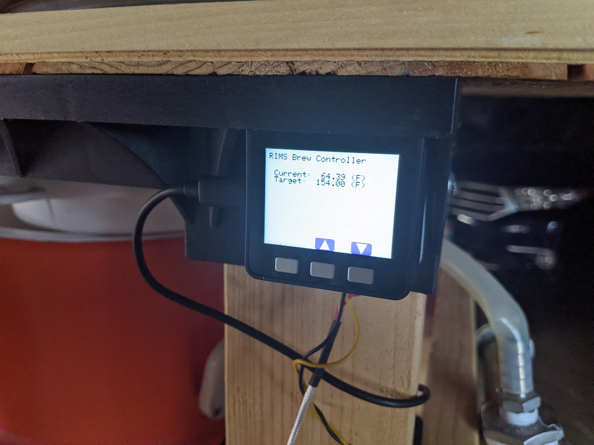
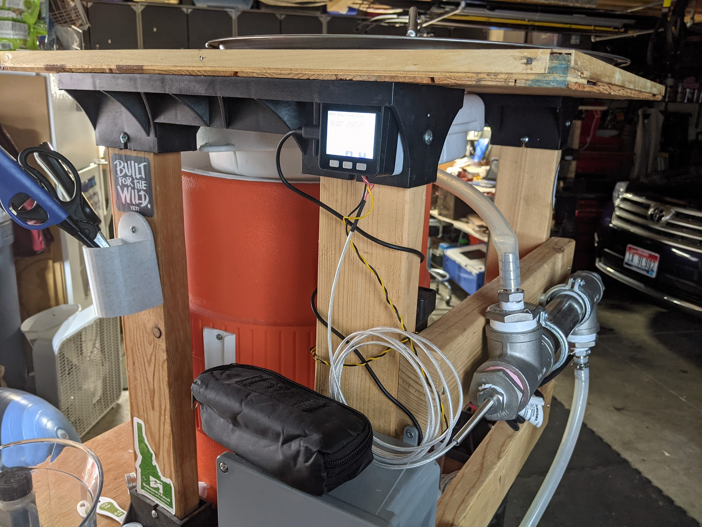

# RIMS Brew Controller
I needed a simpler solution to control the temperature on my RIMS setup.
This uses an esp32 based M5Stack board, with a Digital Logger IoT Relay.

This is much simpler than the previous old Inkbird PID controller and SSR relay.

TODO:
- Mash timer
- Connect to wifi and sync with phone (MQTT or push directly to the phone)
- Ability to add recipis (ie: alarms for each hop/adjunct addition to the boil)
- Boil timers (add audible alert, plus an alert for phone)

   

z

