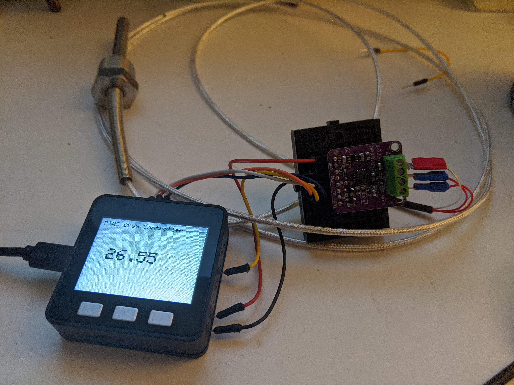

# RIMS Brew Controller

Goals of this project
    Montor and control RIMS temperature during mash via screen and phone

TODO:
   - connect to wifi
   - Push/Pull MQTT data
   - Android AP to get/set temperature
   - Add mash profiles
   - use QR code on screen to setup wifi
   

